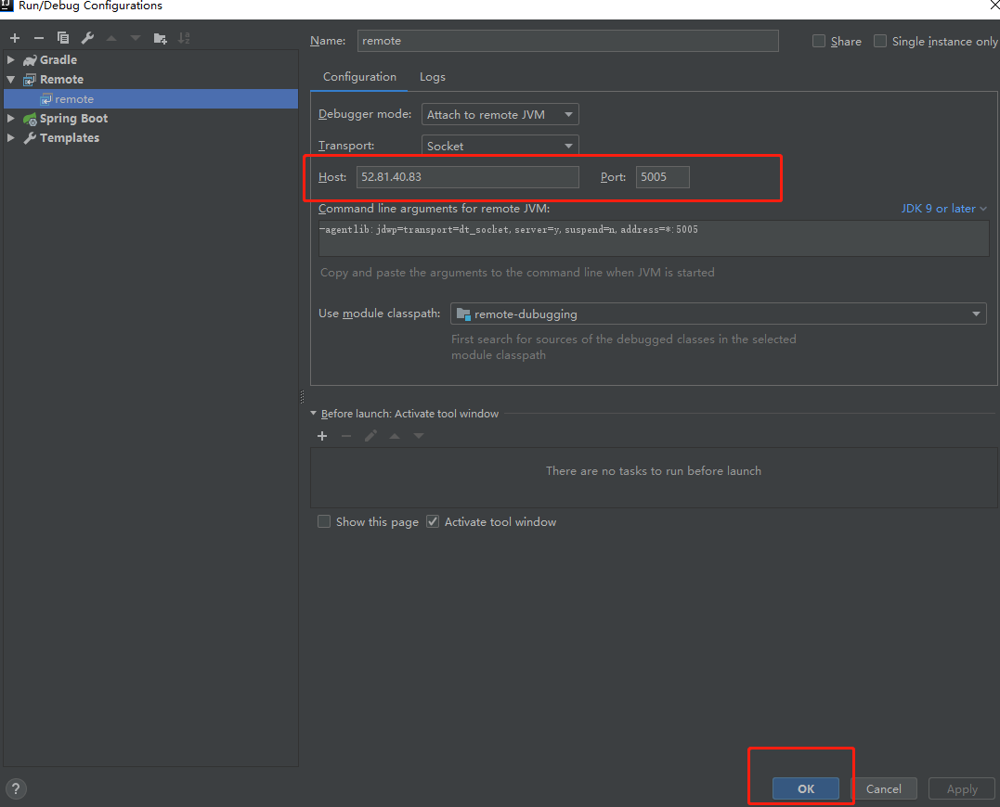

## remote-debugging-demo

需要设置的JVM的参数：
```
-Xdebug -Xrunjdwp:transport=dt_socket,address=*:5005,server=y,suspend=n
```

### 参数解析：
- `-Xdebug` 是通知JVM工作在DEBUG模式下；
- `-Xrunjdwp` 是通知JVM使用(java debug wire protocol, Java调试线协议)来运行调试环境；
- `transport` 指定了调试数据的传送方式；
- `dt_socket` 是指用SOCKET模式，另有dt_shmem指用共享内存方式，其中，dt_shmem只适用于Windows平台； 
- `server` 参数是指是否支持在server模式的VM中`； 
- `onthrow` 指明，当产生该类型的Exception时，JVM就会中断下来，进行调式。该参数可选；
- `launch` 指明，当JVM被中断下来时，执行的可执行程序。该参数可选； 
- `suspend` 指明，是否在调试客户端建立起来后，再执行JVM；
- `onuncaught`(=y或n) 指明出现uncaught exception 后，是否中断JVM的执行。

### 虚拟机参数设置        
1．启用调试服务    
　`-Xdebug` 启用调试         
　`-Xrunjdwp` 加载JVM的JPDA参考实现库 

2．`Xrunjdwp`子参数（sub-options）配置         
　`Xrunjdwp`子参数的配置格式如下    
　`-Xrunjdwp`:[=],[=]…   

### 几个例子
 
`-Xrunjdwp:transport=dt_socket,server=y,address=8000`         
　　在8000端口监听Socket连接，挂起VM并且不加载运行主函数直到调试请求到达
 
`-Xrunjdwp:transport=dt_shmem,server=y,suspend=n`     
选择一个可用的共享内存（因为没有指address）并监听该内存连接，同时加载运行主函数 

`-Xrunjdwp:transport=dt_socket,address=myhost:8000`           
连接到myhost:8000提供的调试服务（server=n，以调试客户端存在），挂起VM并且不加载运行主函数 

`-Xrunjdwp:transport=dt_shmem,address=mysharedmemory` 
通过共享内存的方式连接到调试服务，挂起VM并且不加载运行主函数
 
`-Xrunjdwp:transport=dt_socket,server=y,address=8000,onthrow=java.io.IOException,launch=/usr/local/bin/debugstub`         
等待java.io.IOException被抛出，然后挂起VM并监听8000端口连接，在接到调试请求后以命令/usr/local/bin/debugstub dt_socket myhost:8000执行 

`-Xrunjdwp:transport=dt_shmem,server=y,onuncaught=y,launch=d:\bin\debugstub.exe`        
等待一个RuntimeException被抛出，然后挂起VM并监听一个可用的共享内存，在接到调试请求后以命令d:\bin\debugstub.exe dt_shmem执行,是可用的共享内存

### Java远程调试        
`-Xdebug -Xnoagent -Djava.compiler=NONE -Xrunjdwp:transport=dt_socket,server=y,address=5005,suspend=n`        
- `-XDebug` 启用调试。 
- `-Xnoagent` 禁用默认sun.tools.debug调试器。 
- `-Djava.compiler=NONE` 禁止 JIT 编译器的加载。 
- `-Xrunjdwp` 加载JDWP的JPDA参考执行实例。 
- `transport` 用于在调试程序和 VM 使用的进程之间通讯。 
- `dt_socket` 套接字传输。 
- `dt_shmem` 共享内存传输，仅限于 Windows。 
- `server=y/n` VM 是否需要作为调试服务器执行。 
- `address=5005` 调试服务器的端口号，客户端用来连接服务器的端口号。 
- `suspend=y/n` 是否在调试客户端建立连接之后启动 VM 。 

### 如何用Intellij-IDEA进行java项目的远程调试

步骤如下：         
1. 配置应用进入debug模式，在启动项目时加入虚拟机参数，或者配置"_JAVA_OPTIONS"                  
“-Xdebug -Xrunjdwp:transport=dt_socket,server=y,suspend=n,address=*:5005”：


注意`address`的写法，自从Java9.0以来，JDWP默认只支持到本地，即如果你写成`address=5005`，那么只能在本地进行调试，并不能连接到远程(http://www.oracle.com/technetwork/java/javase/9-notes-3745703.html#JDK-8041435)。

若要远程进行调试则应该在`address`这一参数之前增加`*:`:
```
-Xdebug -Xrunjdwp:transport=dt_socket,server=y,suspend=n,address=*:5005
```

2. Run -> Edit Configurations...进入添加启动项页面：


3. 如果你的启动项中没有点击 "+" ，选择"Remote"添加，自定义一个名字（比如我命名为"remote"）：


4. 配置好你的 HostIp，以及开启的调试端口，点击 "OK" 保存：


5. 点击 "debug" 图标，启动调试：


6. 给项目打上断点，就能像在本地一样调试远程项目了：


### 参考
1. https://stackoverflow.com/questions/21114066/attach-intellij-idea-debugger-to-a-running-java-process
1. https://stackoverflow.com/questions/138511/what-are-java-command-line-options-to-set-to-allow-jvm-to-be-remotely-debugged
1. https://blog.csdn.net/benben683280/article/details/78716397